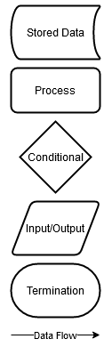
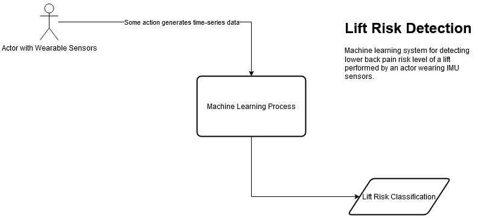
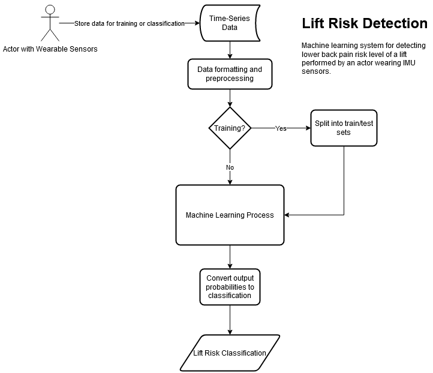
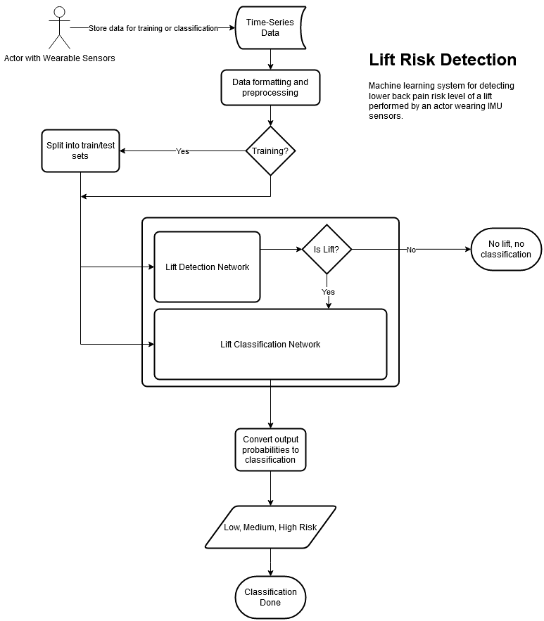

# Design Diagrams

These design diagrams show the design of the lift detection/classification system at different levels of detail. D0 shows least detail, while D2 shows most detail.

## Legend

## D0

## D1

## D2

